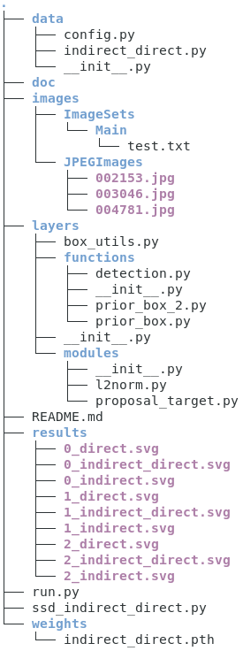

My configurations: Ubuntu 18.04, Python 3.6.9, PyTorch 1.3.1, CUDA 10.1, CUDNN 7.6.5, numpy 1.19.2, opencv 4.4.0, matplotlib 3.3.1.

You should also install the library [RoiAlign](https://github.com/longcw/RoIAlign.pytorch).

Download images and models from [Dropbox](https://www.dropbox.com/s/e7sjnxl47jlbfsy/LPD-demo.zip?dl=0) or [Baidu disk](https://pan.baidu.com/s/1Xxp_xvG3yyqkQvU9zW9G0w) with endorsement code jh7g, then run

```
python run.py
```
All the detection results are in the "results" directory.

The entire document structure:


